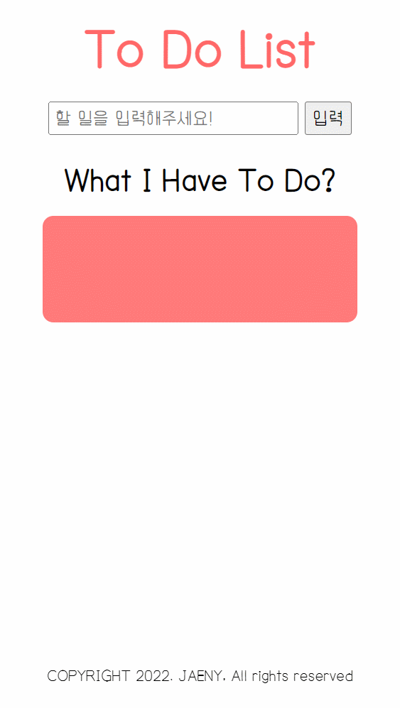
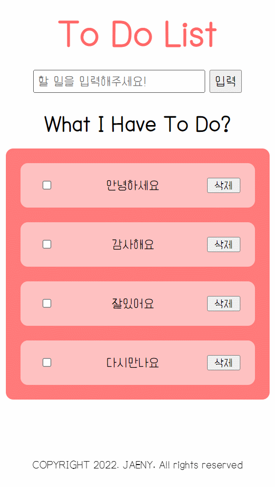
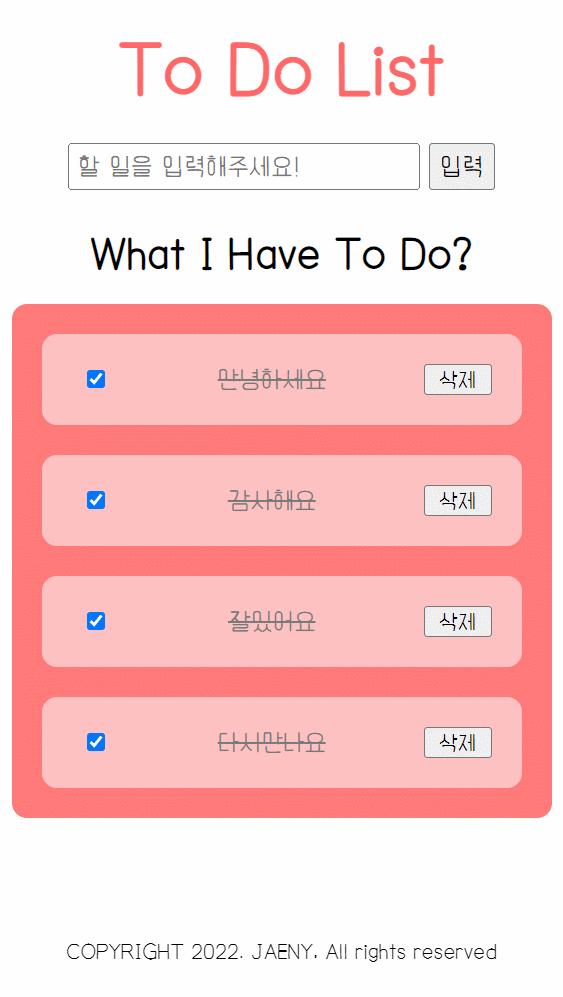
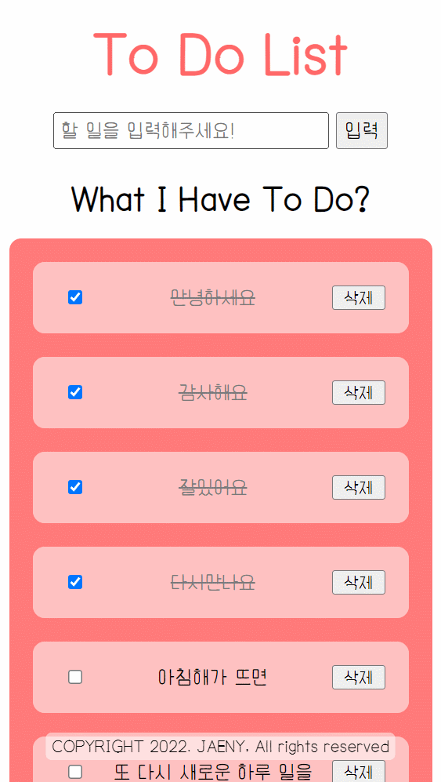

# 바닐라 자바스크립트로 만드는 To Do List

## 기술 스펙 (Tech Stacks)

    

---
## 구현 설명
`Vanilla JavaScipt`와 `HTML`, `Sass`로 만드는 To Do List 웹 애플리케이션
<div align="center">

[](https://hits.seeyoufarm.com)
[](https://hits.seeyoufarm.com)

</div>


### 실행하기

[**페이지 바로가기**](https://jaeny007.github.io/vanilla_js_todolist/) <-- 클릭
<br>

- 페이지가 정상적으로 실행이 되지 않는다면,
`git clone` 명령어를 통해 repository를 local에 다운받아 주세요!

- 다운이 정상적으로 되었다면 `npm start` 명령어를 통해 실행

1. 입력창에 아무 텍스트나 입력 후 키보드의 `Enter` 버튼이나 `입력` 버튼 클릭
2. ToDoList가 정상적으로 출력되는지 확인 후 `삭제` 버튼을 이용해 삭제 혹은
앞의 `CheckBox`를 체크 및 해제하여 할 일의 수행여부를 체크 가능합니다
3. Data의 송수신은 `SessionStorage`를 통해 동작하므로,
브라우저를 새로고침해도 기록은 남습니다.
하지만 브라우저를 완전히 종료했다가 접속하면 기록이 초기화 됩니다

---
### 시연 영상

- [x] **`메인화면`**

<div align="center">

</div>
<br>

- [x] **`할 일 추가`**
<div align="center">


input box에 text 입력 후 `Enter`나 `입력버튼` 클릭으로 할 일 목록이 생성됩니다
</div>
<br>

- [x] **`완료체크`**
<div align="center">


`CheckBox`를 클릭하면 텍스트 스타일링에 변화가 생깁니다
</div>
<br>

- [x] **`할 일 삭제`**
<div align="center">


`삭제버튼`을 누르면, 화면 및 sessionStorage에서 데이터가 삭제됩니다
</div>
<br>

- [x] **`새로고침 시 반응`**
<div align="center">


새로고침시 체크박스가 해제되지만, 데이터는 그대로 남아있습니다
(SessionStorage를 사용했기 때문에)
</div>
<br>

---

### 패키지(라이브러리 등) 사용 근거

    
- **`prettier`**
    
    코드의 가독성을 보다 높이기 위해 사용

- **`lite-server`**
    
    로컬에서 개발 중 실시간 변동사항을 확인하기 위한 서버 라이브러리

- **`sass`**
    
    css를 좀 더 쉽게 작성하기 위해 사용

- **`gh-pages`**
    
    정적 페이지 배포를 위해 사용

---

### 코딩 컨벤션 적용

**폴더 구조**

```
root
  │  README.md
  │  package.json
  │  package-lock.json
  │  bs-config.json
  │  .prettierrc
  │  .gitignore
  │
  │
  └─ src
      index.css
      index.html
      index.scss
      ToDoList.js
```

**네이밍 컨벤션**

- 상수 : `PascalCase`
- 함수, 변수 : `camelCase`
- CSS Class : `kebab-case`

---
## 회고

**배운 점**

- HTML5를 이용한 semantic 마크업
- SCSS(SASS)를 이용한 CSS 작성
- Vanilla JavaScript를 통해 DOM을 조작하는 법(기초)
- EventListener를 통해 click 및 submit 이벤트 처리
- SessionStorage를 이용하여 새로고침 했을때 데이터가 날아가지 않도록 처리하는 방법
- JSDoc을 사용해 함수 등에 주석 달아주기 (함수정보, type 지정 등)


**고치고 싶은 점**

- JavaScript 코드를 좀 더 간결하게 작성할 수 있을지 고민해보고 적용해보고 싶다
- 반응형 스타일 작성이 아직 미숙한듯 하다
- Class 문법을 사용하여 JavaScript 코드 작성이 가능할지 테스트해보고 싶다


**공부해야 한다고 생각하는 것**

- CSS 관련 지식 조각모음하기
- Web API 관련 지식 조각모음하기
- JavaScript 내장함수 지식 조각모음하기
- JavaScript를 통해 더 많은 프로젝트 진행해보기
- JSDoc 잘 사용하는 법, TypeScript...
- webpack 등의 번들러에 관한 공부, build 하는 방법 등...